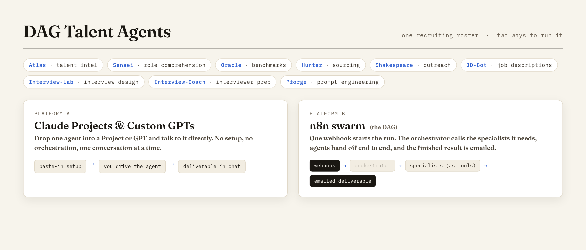
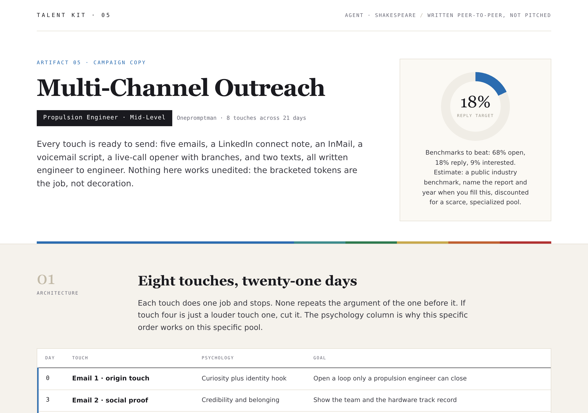

# DAG Talent Agents

**One recruiting roster. Two ways to run it: standalone Claude Projects / Custom GPTs, or an autonomous n8n swarm.**

Recruiting talent agents, organized by the platform they run on. Each platform
folder is a self-contained implementation; pick the one that matches how you work.

## Platforms

### [`claude-projects/`](claude-projects/README.md)
Standalone drop-in recruiting agents for Claude Projects and Custom GPTs. Each
agent is used on its own, one conversation at a time. There is no orchestration
here by design: you drop an agent into a Project or GPT and talk to it directly.
The roster covers market intelligence, role comprehension, sourcing, outreach,
JD writing, interview design, and more.

### [`n8n-swarm/`](n8n-swarm/README.md)
The same recruiting roster wired as an automated n8n pipeline: one request kicks
it off, the agents hand work to each other end to end, and a finished result comes
out. This is the hands-off, end-to-end variant (the "DAG" in the name).

## Which one to use

- Want a helper you drive yourself, one agent at a time? Use `claude-projects/`.
- Want a hands-off pipeline that runs the whole play automatically? Use `n8n-swarm/`.

Both draw on the same underlying agent roster; they differ only in platform and
in whether a human or the workflow does the orchestration.

## Example outputs

The roster produces recruiter-ready deliverables. These are rendered examples from
the same agents (as packaged in the [Talent One](https://github.com/onepromptman/talent-one)
kit); the Claude Projects and n8n editions produce the same intelligence in their
own delivery format (chat or email).

<table>
<tr>
<td width="33%"> <b>Atlas</b> — talent intelligence map</td>
<td width="33%"> <b>JD-Bot</b> — job description</td>
<td width="33%"> <b>Shakespeare</b> — outreach campaign</td>
</tr>
</table>

## License

MIT, see [LICENSE](LICENSE). Provided as-is, with no warranty. The roster is
generic by construction: no real candidate, company, or hiring data, and no API keys.
